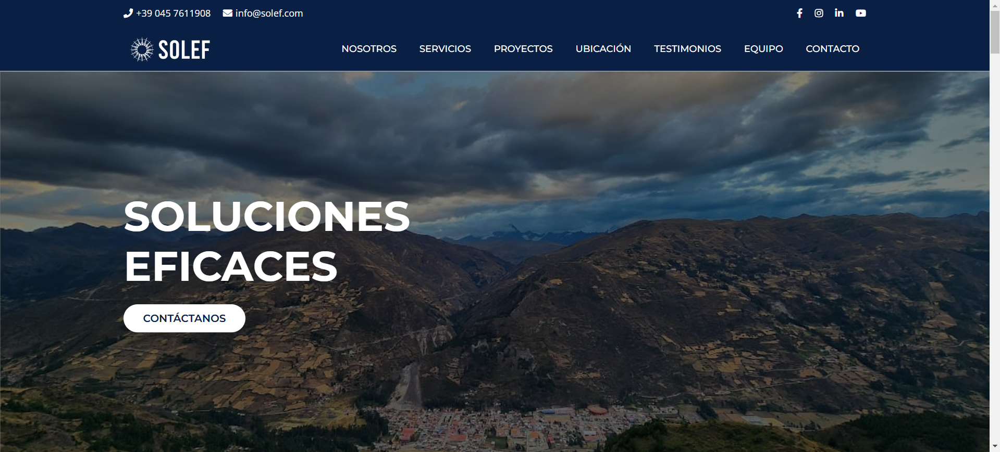

# SOLEF - Consultoría de Ingeniería

**Versión:** 3.0.0   
**Fecha:** Julio 2025

> SOLEF es un proyecto web estático para una consultora de ingeniería, desarrollado puramente con HTML, CSS y JavaScript. El sitio presenta un diseño moderno y adaptable (responsive), y su objetivo es mostrar los servicios, proyectos y equipo de la consultora de una manera profesional y accesible.

## Tabla de Contenidos
1. [Características Principales](#características-principales)
2. [Tecnologías Utilizadas](#tecnologías-utilizadas)
3. [Estructura del Proyecto](#estructura-del-proyecto)
4. [Uso](#uso)
5. [Captura de Pantalla](#captura-de-pantalla)
6. [Agradecimientos](#agradecimientos)
7. [Licencia](#licencia)

## Características Principales

- **Diseño Adaptable (Responsive):** La interfaz se ajusta perfectamente a dispositivos de escritorio, tabletas y móviles.
- **Navegación Intuitiva:** Un menú de navegación claro y un botón "scroll-up" que facilita el desplazamiento por la página.
- **Múltiples Secciones:**
    - **Inicio (`index.html`):** Una página de bienvenida con una imagen heroica y acceso a las principales secciones.
    - **Nosotros (`nosotros.html`):** Describe la misión y visión de la empresa.
    - **Servicios (`servicios.html`):** Muestra las áreas de especialización de la consultora: Forestal, Agrícola y Obras Civiles.
    - **Proyectos (`proyectos.html`):** Presenta una tabla con los proyectos realizados, incluyendo detalles como ubicación, año, estado e inversión.
    - **Ubicación (`ubicacion.html`):** Proporciona la dirección física, horarios de atención y un mapa de Google Maps integrado.
    - **Testimonios (`testimonios.html`):** Muestra comentarios y valoraciones de clientes.
    - **Equipo (`equipo.html`):** Presenta a los ingenieros especialistas del equipo.
    - **Contacto (`contacto.html`):** Un formulario completo para que los visitantes puedan enviar sus consultas.
- **Interactividad con JavaScript:** Incluye funcionalidades como un menú de hamburguesa para móviles y un botón para volver al inicio de la página.
- **Estilo Moderno:** Uso de fuentes de Google Fonts, iconos de Font Awesome y animaciones sutiles para una experiencia de usuario agradable.

## Tecnologías Utilizadas

- **Frontend:**
    - HTML5
    - CSS3 (con Propiedades Personalizadas / Variables)
    - JavaScript (Vanilla JS)
- **Recursos Externos:**
    - [Google Fonts](https://fonts.google.com/) (Montserrat y Open Sans)
    - [Font Awesome](https://fontawesome.com/) (para iconos)

## Estructura del Proyecto

La estructura principal del proyecto es la siguiente:
```
/
├── assets/
│   ├── css/         # Contiene los estilos CSS
│   ├── img/         # Almacena todas las imágenes, organizadas por sección
│   ├── pages/       # Contiene todas las páginas HTML secundarias
│   └── scripts/     # Archivos JavaScript
├── index.html       # Página principal
└── favicon.ico      # Icono del sitio
```

## Uso

Para visualizar el sitio web, simplemente abre el archivo `index.html` en cualquier navegador web moderno. No se requiere de un servidor local, ya que es un proyecto estático.

## Captura de Pantalla




## Agradecimientos

- **Equipo de desarrollo**:
    - Marjoret Lopez
    - Rosa Quispe

## Licencia

Este proyecto está bajo la Licencia MIT.
